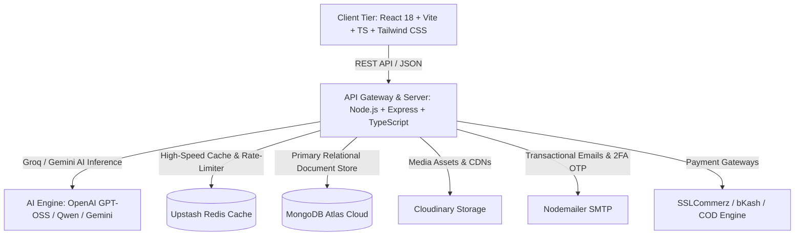

# 🛍️ ShopX BD Enterprise — Full-Stack AI-Powered Multi-Vendor Supermall & SaaS Platform

[](https://github.com/sojibahmedshorif25-ai/Shopx-BD-Enterprise)
[](https://github.com/sojibahmedshorif25-ai/Shopx-BD-Enterprise)
[](https://github.com/sojibahmedshorif25-ai/Shopx-BD-Enterprise)
[](https://github.com/sojibahmedshorif25-ai/Shopx-BD-Enterprise)
[](https://github.com/sojibahmedshorif25-ai/Shopx-BD-Enterprise)
[](https://github.com/sojibahmedshorif25-ai/Shopx-BD-Enterprise)

> **ShopX BD Enterprise** is a production-grade, full-stack multi-vendor e-commerce ecosystem and SaaS platform. Designed to surpass traditional commerce platforms (such as Daraz), it combines ultra-low latency AI shopping copilot, 3D interactive studio, open-box delivery guarantee, multi-tenant merchant storefronts, live GPS rider telemetry, and automated thermal POS printing.

---

## 🌟 Architecture Overview & Tech Stack



### 💻 Technologies & Libraries
- **Frontend & UI:** React 18, Vite, TypeScript, Tailwind CSS, Lucide React, Framer Motion, Canvas Confetti, Zustand.
- **Backend & REST APIs:** Node.js, Express.js, TypeScript, RESTful Architecture, JWT Authentication, Role-Based Access Control (RBAC).
- **Database & Caching:** MongoDB Atlas, Mongoose ODM, Upstash Redis (caching and rate-limiting).
- **AI & Automation:** Groq API (`openai/gpt-oss-120b`, `qwen/qwen3.8-27b`), Google Gemini API.
- **Payments & Logistics:** SSLCommerz Integration, bKash/Nagad manual reconciliation, Cash-on-Delivery, 64-District Logistics Engine with Live GPS tracking simulation.
- **Micro-frontends:** Customer Web App, Admin Command Center, Merchant SaaS Sub-Storefronts, Rider Hub.

---

## 🏛️ 4 Dedicated Enterprise Portals

| Portal / Role | Live Production URL | Description & Key Features |
| :--- | :--- | :--- |
| 🛒 **1. Customer Storefront** | [https://shopx-bd-enterprise.vercel.app](https://shopx-bd-enterprise.vercel.app) | Groq AI Voice/Text search, 10 Flagship Departments, Open-box check, 1-Click COD, 45-day session persistence, Daily Spin Wheel & Coins streak, 0% EMI Calculator. |
| 🏬 **2. Merchant & SaaS Center** | [https://shopx-bd-enterprise.vercel.app/vendor-register](https://shopx-bd-enterprise.vercel.app/vendor-register) | Multi-tenant branded storefronts, thermal POS receipt generation, automated stock alerts, instant wallet payouts, product variants manager. |
| 🛡️ **3. Super Admin Command Center** | [https://shopx-bd-enterprise-qoj6.vercel.app](https://shopx-bd-enterprise-qoj6.vercel.app) | 64-District Live Order Heatmap Radar, GMV telemetry, revenue analytics, dynamic flash sale & coupon engine, seller verification, fraud detection shield. |
| 🚴 **4. DEX Rider Hub** | [https://shopx-bd-enterprise.vercel.app/rider-portal](https://shopx-bd-enterprise.vercel.app/rider-portal) | Real-time GPS order dispatch, 1-tap customer call & Google Maps routing, digital POD signature verification, daily COD reconciliation. |
| ⚡ **5. Cloud REST API & AI Brain** | [https://shopx-bd-enterprise.onrender.com](https://shopx-bd-enterprise.onrender.com) | Node.js + Express + TypeScript + MongoDB Atlas + Upstash Redis + Groq/Gemini LLMs. |

---

## 🚀 Key Industry-Leading Innovations

1. **🤖 Ultra-Fast Groq AI Copilot (<300ms Response):**
   - Natural language and voice-guided shopping assistant capable of parsing Banglish, Bengali, and English queries to recommend exact products matching budgets and specifications.
2. **📦 Open-Box Inspection Guarantee:**
   - Gives customers the confidence to inspect parcels before accepting COD, eliminating counterfeit fears.
3. **🗺️ 64-District Geolocation & Smart Shipping Engine:**
   - 24-Hour Express Delivery in Dhaka (৳60) and 48-72 Hour Delivery in 63 districts (৳120).
4. **🖨️ Offline Thermal POS Printing:**
   - Integrated with merchant dashboards for instantaneous in-store retail checkout and tax invoice generation.
5. **🔐 Bank-Grade Security & 2FA:**
   - 6-digit real Gmail SMTP OTP delivery, brute-force lockout safeguards, and secure JWT-based role authorizations.

---

## ⚙️ Quick Start Guide

### 1. Clone & Install
```bash
git clone https://github.com/sojibahmedshorif25-ai/Shopx-BD-Enterprise.git
cd Shopx-BD-Enterprise

# Install all sub-packages
cd backend && npm install
cd ../frontend && npm install
cd ../admin && npm install
```

### 2. Environment Configuration
Configure `.env` files in `backend/`, `frontend/`, and `admin/` using the provided samples.

### 3. Run Development Servers
```bash
# Terminal 1: Backend API (Port 5000)
cd backend && npm run dev

# Terminal 2: Customer Storefront (Port 5173)
cd frontend && npm run dev

# Terminal 3: Admin Command Center (Port 5174)
cd admin && npm run dev
```

---

## 🏢 Official Contact & Corporate Details
- **🏢 Head Office:** Rowmari, Kurigram, Rangpur, Bangladesh
- **📞 Helpline:** `+880 1942-791004`
- **📧 Email:** `sojibahmedshorif25@gmail.com`
- **👑 Founder & Lead Engineer:** Sojib Ahmed Shorif

---

## 📄 License
MIT © 2026 ShopX BD Enterprise. Built with excellence for next-generation digital commerce.
